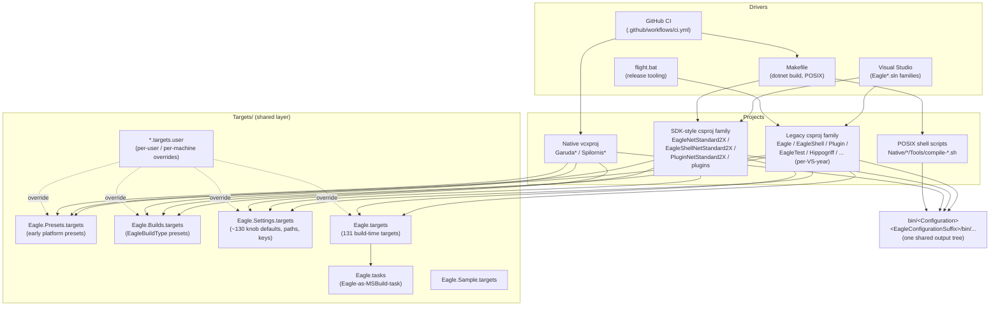
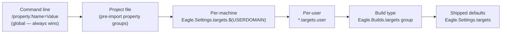
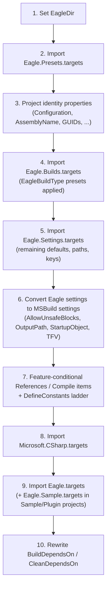
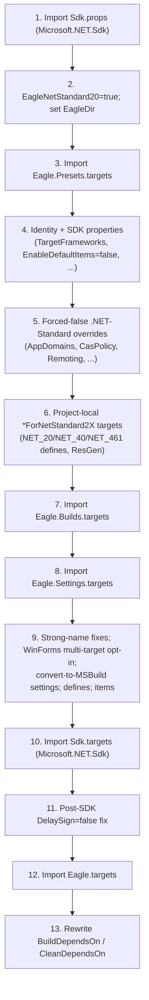
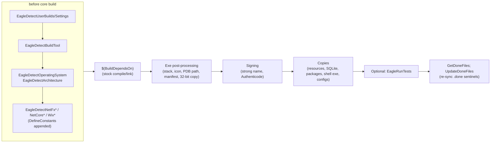

# The Eagle MSBuild Build System

*A reference for the MSBuild-related artifacts in the Eagle source tree: the
shared targets files, the project families, the build "knobs" that control
them, and the consequences of turning those knobs.*

> Scope note: line numbers cited below refer to the tree as of 2026-07-30
> (trunk). They will drift over time; section and property names are the
> stable reference points. The header comment shared by the targets files
> sets expectations honestly: *"Contains more evil MSBuild hacks than your
> doctor recommended."*

---

## Table of Contents

1. [The Big Picture](#1-the-big-picture)
2. [The Shared Targets Files](#2-the-shared-targets-files)
3. [Import Order and the Evaluation Model](#3-import-order-and-the-evaluation-model)
4. [The Knob Model](#4-the-knob-model)
5. [Major Knobs Reference](#5-major-knobs-reference)
6. [Build-Time Targets (Eagle.targets)](#6-build-time-targets-eagletargets)
7. [Drivers: Solutions, Makefile, CI, Native](#7-drivers-solutions-makefile-ci-native)
8. [Gotchas and Consequences](#8-gotchas-and-consequences)
9. [Recipes](#9-recipes)

---

## 1. The Big Picture

Eagle's build system is layered.  Every managed project — whether a legacy
Visual Studio project (2005–2022) or an SDK-style `*NetStandard2X` project —
imports the same four shared targets files from `Targets/`, in the same
relative order, and then rewires `BuildDependsOn` to weave Eagle's own
detection, signing, copying, and testing targets around the stock build.



### Artifact inventory

| Artifact | Where | Role |
|---|---|---|
| `Eagle.Presets.targets` (111 lines) | `Targets/` | Earliest-imported presets: `EagleNetStandard20/21`, `EagleNetCore*` |
| `Eagle.Builds.targets` (~1,580 lines) | `Targets/` | The 22 named `EagleBuildType` preset groups + test-type argument presets |
| `Eagle.Settings.targets` (~2,165 lines) | `Targets/` | The master knob catalog: ~130 feature/behavior defaults, output paths, strong-name keys, warnings |
| `Eagle.targets` (~3,924 lines) | `Targets/` | 131 build-time `<Target>`s: detection, signing, post-processing, copying, resgen, tests |
| `Eagle.tasks` (103 lines) | `Targets/` | `UsingTask` declarations for `EagleTasks.dll` — evaluate Eagle scripts *from* MSBuild |
| `Eagle.Sample.targets` (225 lines) | `Targets/` | Sample-plugin resgen + live demo of the Eagle MSBuild tasks |
| `*.targets.user` files | `Targets/` | Per-user (and per-machine) override hooks for each of the above |
| Legacy csproj families | `Library/`, `Shell/`, `Sample/`, `Test/`, `Update/`, `Example/`, `Toolkit/`, `Build/`, … | One base project + per-VS-year variants (2005–2022), nearly identical |
| SDK-style csproj | `Library/`, `Shell/`, `Sample/`, `Plugins/**` | `*NetStandard2X.csproj` — manual `Sdk.props`/`Sdk.targets` sandwich |
| Solutions (42+) | root | Four families × VS years + NetStandard2X variants (§7.1) |
| `Makefile` / `Makefile.eagle` | root | POSIX driver for the NetStandard2X build (§7.2) |
| `.github/workflows/ci.yml` | `.github/` | Three-OS CI pipeline (§7.3) |
| `Garuda*.vcxproj`, `Spilornis*.vcxproj`, `props/*.props` | `Native/Package/`, `Native/Utility/` | Native Tcl package + native utility library (§7.4) |
| `Native/*/Tools/compile-*.sh` | `Native/*/Tools/` | POSIX native builds that bypass MSBuild entirely |

---

## 2. The Shared Targets Files

### 2.1 Eagle.Presets.targets — earliest presets

Imported **first**, before even `Microsoft.Common.props`, because a few
properties must exist before `Eagle.Builds.targets` evaluates.  It sets:

| Property | Default | Notes |
|---|---|---|
| `EagleNetStandard20` | `false` | The auto-set-from-build-type line is deliberately commented out |
| `EagleNetStandard21` | `true` **iff** `EagleBuildType == NetStandard21`, else `false` | The auto-set *is* active for 2.1 |
| `EagleNetCoreReferences` | `true` — **only when `EagleBuildType` is empty** | Gates extra package/framework references |
| `EagleNetCore20` / `EagleNetCore30` | `true` — only when `EagleBuildType` is empty | Enable .NET Core 2.0 / 3.0 API features |

Its comment block also records the **required companion properties** for any
.NET Standard build (see [Recipes](#9-recipes)).

### 2.2 Eagle.Builds.targets — named build types

Pure property groups (it defines **no** targets).  Selecting
`/property:EagleBuildType=<name>` applies one of 22 preset groups; every value
inside is guarded `Condition="'$(Prop)' == ''"`, so presets **never override**
the command line or a `.user` file.  Details in §5.1.

It also computes the `EagleCanSetTargetFrameworkVersion` gate (false for any
`netstandard*`/`netcoreapp*`/`net5.0+` TargetFramework — legacy
`TargetFrameworkVersion` values cannot be applied there), and translates
`EagleTestType` into canned test-suite argument sets
(`EagleCommonTestArguments`, `EagleTestArguments`, `EagleTestFlags`).

### 2.3 Eagle.Settings.targets — the master knob catalog

~130 documented knobs with their shipped defaults (§5), plus:

- **Output-path computation** — `EagleBinaryOutputPath`,
  `EaglePackageOutputPath`, `EagleDocumentationOutputPath`, `EagleTaskPath`,
  and (non-SDK only) `BaseIntermediateOutputPath`, all derived from
  `$(Configuration)` + `$(EagleConfigurationSuffix)`.
- **Strong-name key selection** — `SignAssembly`, `DelaySign`,
  `AssemblyOriginatorKeyFile` (public key when delay-signing, private pair
  otherwise), `EaglePrivateKeyFile`.
- **Warning policy** — `WarningLevel=4`, `NoWarn=612,618,1572` (+`1574`
  pre-Roslyn).
- **Generic VS hygiene** — unconditional `Prefer32Bit=false`,
  `UseVSHostingProcess=false`, `GenerateDependencyFile=false` (a `deps.json`
  can crash the .NET Core runtime), `NoWin32Manifest=true` (Eagle embeds its
  own manifest).

### 2.4 Eagle.targets — build-time behavior

All 131 targets, wired in by each project's `BuildDependsOn` rewrite (§3.3,
§6).  Incrementality is sentinel-based: post-processing targets are gated on
`$(TargetPath).<Name>.done` files, re-synced by `UpdateDoneFiles` at the end
of every build and removed by `CleanDoneFiles` on clean.

### 2.5 Eagle.tasks and Eagle.Sample.targets — Eagle builds Eagle

`Eagle.tasks` declares five custom tasks loaded from
`$(EagleTaskPath)EagleTasks.dll` (built by `Build/EagleTasks*.csproj`):
`EvaluateExpression`, `EvaluateScript`, `EvaluateFile`, `SubstituteString`,
`SubstituteFile` — i.e., MSBuild can run Eagle scripts mid-build.  Every
declaration is conditioned on the DLL existing, so a fresh checkout without a
bootstrap build is safe (chicken-and-egg avoided).  `Eagle.targets` uses them
for `LockBuildOutputDirectories`/`UnlockBuildOutputDirectories`
(`lockBuild.eagle`); `Eagle.Sample.targets` demonstrates all five.

### 2.6 The override chain

Each targets file imports an optional `.user` companion **before** its own
defaults; `Eagle.Settings.targets.user` additionally imports a per-machine
`Eagle.Settings.targets.$(USERDOMAIN)` first.  Because every shipped default
is `== ''`-guarded, precedence is strict:



Two conventions keep this sane:

- The `.user` overrides are doubly guarded
  `'$(EagleBuildType)' == '' And '$(Prop)' == ''` — personal settings never
  contaminate a named build type.
- When any `.user` file is active, the `EagleDetectUserBuilds` /
  `EagleDetectUserSettings` targets emit a build **warning** that overrides
  are in effect.

> **Placement rule:** `EagleBuildType` itself must be set on the command line
> or in `Eagle.Builds.targets.user` — *never* in `Eagle.Settings.targets(.user)`,
> which is imported after `Eagle.Builds.targets` has already consumed it.

---

## 3. Import Order and the Evaluation Model

MSBuild evaluates properties in a **single top-to-bottom pass**, expanding
imports in place.  Where a property group sits relative to the imports is
therefore load-bearing — several of the gotchas in §8 are exactly this.

### 3.1 Legacy project sandwich (e.g. `Library/Eagle.csproj`)



Per-VS-year variants (`Eagle2005.csproj` … `Eagle2022.csproj`) differ only in
`ToolsVersion`, the optional `Microsoft.Common.props` import (2012+), the
`Microsoft.CSharp.targets` location, and which `EagleSetStack*`/
`EagleDetectVs*` targets appear in `BuildDependsOn`.  The un-suffixed project
*is* the VS2005 variant.

### 3.2 SDK-style sandwich (e.g. `Library/EagleNetStandard2X.csproj`)

The SDK projects **cannot** use `<Project Sdk="Microsoft.NET.Sdk">`: the
implicit `Sdk.targets` import would land after the project body and the
`BuildDependsOn` rewrite would not be honored
([microsoft/msbuild#1680](https://github.com/Microsoft/msbuild/issues/1680)).
Instead they import the SDK explicitly at both ends:



Key SDK-specific mechanics in the core library project:

- `TargetFrameworks` = `netstandard2.0` or `netstandard2.1` per
  `EagleNetStandard21`.
- The **WinForms multi-target opt-in block** sits *after* the
  Builds/Settings imports (step 9), so the `false` defaults those files
  provide are visible when its `'$(EagleDrawing)' != 'false' And
  '$(EagleWinForms)' != 'false'` condition is evaluated.  When opted in, it
  multi-targets `netstandard2.1;netcoreapp3.0` and sets
  `UseWindowsForms`/`EnableWindowsTargeting` for the `netcoreapp3.0` leg
  (which carries WinForms for the HotKey/Featherlight plugins).  See the
  recipe in §9 — **all three** opt-in properties are required.
- `EnableDefaultItems=false`, `GenerateAssemblyInfo=false` — all sources are
  listed explicitly, mirroring the legacy project exactly.
- `SignAssembly=true` and `DelaySign=false` are forced before `Sdk.targets`
  (`sn.exe` "behaves badly" against .NET Core assemblies), and
  `DelaySign=false` is re-forced *after* it (the SDK resets it to an empty
  string), plus `PublicSign=true` off-Windows.

### 3.3 BuildDependsOn surgery and the sentinel system

Every project replaces `BuildDependsOn` with:
*detection targets* → `$(BuildDependsOn)` (the stock build) →
*post-processing* (sign, stack, icon, manifest, copies, optional tests) →
`GetDoneFiles; UpdateDoneFiles`.



Because several post-processing steps rewrite `$(TargetPath)` in sequence,
each is incremental against its own `$(TargetPath).<Name>.done` sentinel, and
`UpdateDoneFiles` re-touches them all at the end so the next build does not
cascade-retrigger every step.  `FixCopyFilesToOutputDirectory` copies the
post-processed binary back over the intermediate in `obj\` so an incremental
build cannot restore an unsigned copy.

Feature-off projects swap their entire `BuildDependsOn` for a warning stub
(`MissingShell`, `MissingWinForms`, `MissingXml`, …) that skips the project
with a diagnostic instead of failing.

---

## 4. The Knob Model

Four idioms recur everywhere; recognizing them tells you how any given knob
behaves:

1. **Settable default** — `<Prop Condition="'$(Prop)' == ''">value</Prop>`.
   The shipped default; anything upstream (command line, `.user`, earlier
   import) wins.  Nearly every knob is defined this way.
2. **Opt-out gate** — `Condition="'$(Prop)' != 'false'"`.  *Enabled unless
   explicitly false.*  Crucially, an **empty** value counts as enabled — this
   is why defaults must be applied *before* such a condition is evaluated
   (see §8.1).
3. **Opt-in gate** — `Condition="'$(Prop)' != '' And '$(Prop)' != 'false'"`.
   *Disabled unless explicitly set.*  Used for `OFFICIAL_BINARY`, `OPEN_SSL`,
   and the whole Enterprise section.
4. **Feature → symbol → `#if`** — each feature knob appends one symbol to
   `DefineConstants` (e.g. `EagleDebugger` → `DEBUGGER`), and the C# sources
   are littered with matching `#if DEBUGGER` blocks.  Turning a knob changes
   *what is compiled*, not just how the build runs.

Where to set a knob, in order of preference:

| Mechanism | When to use |
|---|---|
| `/property:Name=Value` on the command line | One-off builds, CI, scripting — always wins |
| `Targets/Eagle.Builds.targets.user` | Your standing `EagleBuildType` choice |
| `Targets/Eagle.Settings.targets.user` | Personal feature defaults (auto-disabled when a build type is selected) |
| `Targets/Eagle.Settings.targets.$(USERDOMAIN)` | Per-machine variants of the above |
| The project file | Structural per-project policy (e.g. the NetStandard2X forced-false lists) |

---

## 5. Major Knobs Reference

### 5.1 `EagleBuildType` — the master preset

One knob to configure dozens.  22 recognized values (all presets are
`== ''`-guarded — your explicit settings survive):

| Value | Target | Suffix | Notes |
|---|---|---|---|
| `Default` | .NET Fx 2.0 (TFV not set) | `NetFx20` | Official-release type; suffix is *not* "Default" |
| `NetFx20` | v2.0 | `NetFx20` | Official-release type |
| `NetFx35` | v3.5 | `NetFx35` | PowerShell 2.0 |
| `NetFx40` | v4.0 | `NetFx40` | Official-release type; PowerShell 3.0 |
| `NetFx45`–`NetFx481` | v4.5 … v4.8.1 | matches name | `EagleCompression=true` from 4.5 up; PowerShell 5.0; only `NetFx462` is an official-release type |
| `NetStandard20` | `TargetFramework=netstandard2.0` | `NetStandard20` | Disables Configuration/Drawing/Remoting/WinForms; sets `EagleNetStandard20=true` |
| `NetStandard21` | `TargetFramework=netstandard2.1` (singular!) | `NetStandard21` | As above plus `EagleNetStandard21=true`; see §8.2 |
| `Bare` | v2.0 via `EagleOnlyNetFx20` | `Bare` | Strips nearly *every* optional feature — exists to expose hidden inter-feature dependencies via compile errors; no support guarantee |
| `LeanAndMean` | v4.0 | `LeanAndMean` | Strips features that cost speed; no support guarantee |
| `Database` | v2.0 via `EagleOnlyNetFx20` | `Database` | Safe for hosting inside SQL Server (no Drawing/Web/WinForms/Remoting; native *package* and *utility* off — core `EagleNative` stays on) |
| `MonoOnUnix` | v4.0 | `MonoOnUnix` | Official-release type; `EagleMono=true`, `EagleWindows=false`, `EagleUnix=true`, 1 MiB stack |
| `Development` | (inherit) | `Development` | Dev workflow: `EagleDeadCode`/`EagleObsolete`/`EaglePolicyTrace`/`EagleForTestUseOnly` on, Authenticode off, static shell |

**Consequences of using it:**

- The chosen `EagleConfigurationSuffix` renames the entire output tree
  (`bin/Debug<suffix>/…`), the intermediate tree, and the package dirs —
  every downstream consumer (Makefile, CI copy steps, native props, plugin
  builds) keys off it.
- Setting a build type **suppresses** the `Eagle.Settings.targets.user`
  personal overrides that follow the conventional `'$(EagleBuildType)' == ''`
  guard (most do; the file itself is still imported, so unguarded entries —
  e.g. `SignAssembly`, the `EagleKit` groups — still apply), and the
  `EagleNetCore*` presets (which apply only when no build type is chosen).
- **Every** build-type comment repeats the same warning: building directly
  with MSBuild (i.e., not via the `flight.bat` release tool) **requires
  `/property:EaglePatchLevel=false`**, otherwise the `AssemblyVersion`
  attribute value is null and compilation fails.

### 5.2 Target framework and platform knobs

| Knob | Default | Effect / consequences |
|---|---|---|
| `EagleNetStandard20` | `false` (Presets); forced `true` in every SDK-style project | Defines `NET_STANDARD_20`; flips all legacy-only Reference/Compile groups off |
| `EagleNetStandard21` | auto-`true` under `EagleBuildType=NetStandard21`, else `false` | Defines `NET_STANDARD_21`; selects `netstandard2.1` in the SDK core.  The SDK core's *early* `NetStandard21` suffix selection additionally requires `EagleDrawing` and `EagleWinForms` to be explicitly enabled (the WinForms opt-in); otherwise the suffix comes from the `EagleBuildType=NetStandard21` preset |
| `EagleCanSetTargetFrameworkVersion` | computed | Blocks legacy `TargetFrameworkVersion` assignment for netstandard/netcoreapp/net5+ builds |
| `EagleOnlyNetFx20` | `false` | Forces `TargetFrameworkVersion=v2.0` in consuming projects; defines `NET_20_ONLY`; prohibits post-2.0 features |
| `EagleWindows` / `EagleUnix` | `true` / `false` | Define `WINDOWS`/`UNIX`; the documented Unix build sets `/p:EagleWindows=false /p:EagleUnix=true` |
| `EagleMono` / `EagleMonoBuild` | `false` / `false` | Building *for* Mono vs *with* Mono (xbuild); `MONO`/`MONO_BUILD` |
| `EagleMonoHacks` / `EagleMonoLegacy` | `true` / `true` | Avoid constructs broken on Mono ≥2.4 / ≤2.2; disabling risks "spectacular failures" |
| `EagleDrawing` / `EagleWinForms` | `true` under legacy MSBuild; **`false` under the .NET SDK** (`UsingMicrosoftNETSdk` conditioned) | Gate `System.Drawing` / `System.Windows.Forms` references, `DRAWING`/`WINFORMS` defines, and the SDK core's WinForms multi-target block |

**The WinForms multi-target opt-in (SDK core).**  The block in
`EagleNetStandard2X.csproj` — deliberately placed *after* the
Builds/Settings imports so the SDK-conditioned `false` defaults are visible
to its `!= 'false'` condition — multi-targets the core to
`netstandard2.1;netcoreapp3.0` with `UseWindowsForms` on the 3.0 leg.  The
verified recipe (all three properties, and **no** `EagleBuildType`):

```
dotnet build Library/EagleNetStandard2X.csproj \
    /property:EagleNetStandard21=true \
    /property:EagleDrawing=true \
    /property:EagleWinForms=true \
    /property:EaglePatchLevel=false
```

Why all three: without `EagleNetStandard21=true`, the early
`EagleConfigurationSuffix` selection cannot pick `NetStandard21` before
`Eagle.Settings.targets` bakes the output paths, and binaries land in an
unsuffixed `bin/Debug/bin/` tree.  Why no build type: the `NetStandard21`
preset sets `TargetFramework` (singular), which makes the SDK ignore
`TargetFrameworks` and silently degrade to a single-target build (§8.2).

### 5.3 Feature flags and their `#if` symbols

Each knob below defaults per `Eagle.Settings.targets` (build types may
override) and maps to one `DefineConstants` symbol via the "Project
Compile-Time Options" ladder — identical in the legacy and SDK core
projects.  The gate idiom is opt-out (`!= 'false'`) unless noted.

**Core language / engine**

| Knob | Default | Symbol | Consequence highlights |
|---|---|---|---|
| `EagleShell` | true | `SHELL` | Off: shell projects skip themselves entirely (`MissingShell`) |
| `EagleDebugger` (+`Arguments`,`Engine`,`Execute`,`Expression`,`Variable`,`Breakpoints`) | true | `DEBUGGER`, `DEBUGGER_*` | Off: no breakpoints/watchpoints/stepping; several sub-knobs trade perf for capability |
| `EagleThreading` | true | `THREADING` | Off: call-frame races under multi-threaded evaluation |
| `EagleProfiler` | true | `PROFILER` | Off: no per-interpreter metrics |
| `EagleHistory` | false | `HISTORY` | Command history tracking |
| `EaglePreviousResult` | true | `PREVIOUS_RESULT` | Off: some debugging functions impaired |
| `EagleCallbackQueue` | true | `CALLBACK_QUEUE` | Engine completion callbacks |
| `EagleExpressionFlags` | true | `EXPRESSION_FLAGS` | Restrict expression token types |
| `EagleInteractiveCommands` | true | `INTERACTIVE_COMMANDS` | Built-in `#`-style shell commands |
| `EagleScriptArguments` | false | `SCRIPT_ARGUMENTS` | Track nested script args (perf cost) |
| `EagleResultLimits` | true | `RESULT_LIMITS` | Off: memory-exhaustion risk; on: slight eval cost |
| `EagleUseNamespaces` | false | `USE_NAMESPACES` | Tcl 8.4-compatible namespaces on for new interpreters |
| `EagleTest` / `EagleTestPlugin` | true / true | `TEST` / `TEST_PLUGIN` | Dedicated test code / plugin |

**Notifications** (plugin event system)

| Knob | Default | Symbol | Notes |
|---|---|---|---|
| `EagleNotify` | true | `NOTIFY` | Off keeps only refcounting-essential notifications |
| `EagleNotifyObject` | true | `NOTIFY_OBJECT` | **"DO NOT CHANGE OR DISABLE THIS SETTING UNLESS YOU KNOW EXACTLY WHAT IT DOES AND HOW IT WORKS"** — object-handle reference counting depends on it |
| `EagleNotifyArguments` / `Global` / `Exception` / `Execute` / `Expression` / `Tcl` | true | `NOTIFY_*` | Per-event-class granularity |
| `EagleNotifyActive` | false | `NOTIFY_ACTIVE` | Interpreter push/pop events — notable slowdown |

**Interop / native / isolation**

| Knob | Default | Symbol | Notes |
|---|---|---|---|
| `EagleNative` | true | `NATIVE` | Master P/Invoke gate; **gates all Tcl integration** |
| `EagleNativePackage` | true | `NATIVE_PACKAGE` | Required for Garuda (CLR hosted from native Tcl) |
| `EagleNativeUtility` | true | `NATIVE_UTILITY` | Spilornis; off: list split/join perf drop |
| `EagleNativeUtilityBstr` | true | `NATIVE_UTILITY_BSTR` | Win32 `SysStringLen`; **malfunctions on non-Windows** |
| `EagleNativeThreadId` | true | `NATIVE_THREAD_ID` | — |
| `EagleTcl` (+`TclKits`,`TclThreaded`,`TclThreads`,`TclUnicode`,`TclWrapper`) | true (Wrapper false) | `TCL`, `TCL_*` | Tcl/Tk integration family; `TclThreaded` refuses non-threaded Tcl at runtime |
| `EagleAppDomains` | false | `APPDOMAINS` | AppDomain management |
| `EagleIsolatedInterpreters` / `EagleIsolatedPlugins` | false / false | `ISOLATED_*` | AppDomain isolation — unavailable on .NET Core |
| `EagleCasPolicy` | false | `CAS_POLICY` | Deprecated as of CLR v4 |
| `EagleEmit` | true | `EMIT` | `System.Reflection.Emit`; SDK builds add the Emit packages when on |
| `EagleLibrary` | true | `LIBRARY` | Native library integration |

**BCL usage** — `EagleNetwork`→`NETWORK`, `EagleConsole`→`CONSOLE`
(off can break *dependent projects*), `EagleCompression`→`COMPRESSION`
(needs .NET 4.5+), `EagleConfiguration`→`CONFIGURATION`, `EagleData`→`DATA`,
`EagleDrawing`→`DRAWING`, `EagleRemoting`→`REMOTING`,
`EagleSerialization`→`SERIALIZATION`, `EagleWeb`→`WEB`,
`EagleWinForms`→`WINFORMS`, `EagleXml`→`XML`, `EagleUnsafe`→`UNSAFE`
(also sets `AllowUnsafeBlocks`).

**Diagnostics** — `EagleDebugTrace`→`DEBUG_TRACE`,
`EagleDebugWrite`→`DEBUG_WRITE`, `EagleForceTrace`→`FORCE_TRACE` (force
diagnostics in release), `EagleMaybeTrace`→`MAYBE_TRACE` (throttles — may
silently drop messages), `EaglePolicyTrace`→`POLICY_TRACE`,
`EagleVerbose`→`VERBOSE`, `EagleBreakOnExiting`→`BREAK_ON_EXITING`.

**Caches (largely experimental)** — `EagleArgumentCache`, `EagleParseCache`,
`EagleListCache`, `EagleExecuteCache`, `EagleTypeCache`, `EagleComTypeCache`,
`EagleCacheStatistics`, and the `EagleCache*ToString` family (all default
true, symbols `*_CACHE`/`CACHE_*`); `EagleCacheDictionary` and
`EagleFastDictionary` default **false** ("not fully regression tested").
`EagleFastErrorCode`/`EagleFastErrorInfo` (default false) skip
trace/notify/watch processing on `errorCode`/`errorInfo` writes — faster,
but code depending on those events breaks.

**Identity / robustness** — `EagleThrowOnDisposed` (true; disposed-object
access throws), `EagleEmbeddedLibrary` (false; embed the script library for
single-file deployment — flips the script search order),
`EagleRandomizeId`/`EagleSharedIdPool`/`EagleUseAppDomainForId` (ID-pool
behavior), `EagleStatic`/`EagleDynamic` (+`EagleShellStartupObject` —
must match: `StaticCommandLine` vs `DynamicCommandLine`; the SDK shell forces
static because .NET Core reflection "robustness"), `EagleOfficial`/
`EagleStable`/`EagleOfficialBinary` (release stamps — `OFFICIAL_BINARY` also
requires `Components\Shared\BinaryLicense.cs` to exist; team-only, with
licensing implications).

**Versioning** — `EaglePatchLevel`→`PATCHLEVEL` (version from the
externally-stamped `PatchLevel.cs`; hence the mandatory `false` outside
`flight.bat`), `EagleSourceId`→`SOURCE_ID` and
`EagleSourceTimeStamp`→`SOURCE_TIMESTAMP` (stamped from the **Fossil**
checkout; zeros without one), `EagleAssemblyDateTime`/`Release`/`Text`/
`Tag`/`Uri`/`StrongNameTag` (release-prep attributes fed via stdin).

### 5.4 Output and layout knobs

| Knob | Default | Consequences |
|---|---|---|
| `EagleConfigurationSuffix` | set by build type / project | Names the whole output universe: `bin/<Config><Suffix>/bin/`, `obj/<Project>/<Suffix>/`, `lib/<Assembly><Ver>/`.  Anything that changes it must do so **before** `Eagle.Settings.targets` is imported — the paths are baked at import time |
| `EagleBinaryOutputPath` | `$(EagleDir)\bin\$(Configuration)$(EagleConfigurationSuffix)\bin\` | Becomes `OutputPath` for non-package projects |
| `EaglePackageOutputPath` | `…\lib\$(AssemblyName)$(EaglePackageVersion)\` | Plugin/package output (`EaglePackageVersion` supplied per project) |
| `EagleBaseIntermediateOutputPath` | `true` legacy / **`false` under the .NET SDK** | Gates centralizing `BaseIntermediateOutputPath` — setting that under the SDK **breaks the build** ([dotnet/sdk#1518](https://github.com/dotnet/sdk/issues/1518)); the VS IDE also has "a nasty habit of ignoring" it — "When in doubt, build from the command line" |
| `EagleTaskPath` | `…\bin\BuildTasks\` | Where MSBuild loads `EagleTasks.dll`/`EagleShell.exe` from (a *copy*, so the real output is not file-locked) |
| `EagleDocumentationFile` | true | XML doc generation (historically broke incremental builds in old VS) |

### 5.5 Signing knobs

| Knob | Default | Notes |
|---|---|---|
| `SignAssembly` | true (when key dir present) | Master strong-name gate |
| `DelaySign` | true (legacy) / forced false (SDK) | Legacy delay-signs **because post-build tasks modify the executables** (a full signature would be invalidated), then `EagleStrongNameSign` completes it with `sn.exe -Ra`; SDK projects sign fully up front instead |
| `EagleStrongNameSign` / `…32BitOnly` | true | Re-sign with `EaglePrivateKeyFile` (not in the public distribution — outsiders use `Library/Tools/strongName.bat` verification-skipping) |
| `EagleStrongNamePrefix` | `EagleFast` | Selects the key pair (`EagleFast*/EagleBeta*/EagleStrong*.snk` in `Keys/`) |
| `StrongNameWithoutSdk` / `OverrideDirForStrongName` / `TargetFrameworkSDKToolsDirectory` | false / — / — | Alternate `sn.exe` lookups (the stock `GetFrameworkSDKPath` is documented broken since VS2012) |
| `EagleAuthenticodeSign` (+`Sign1..4`, `…32BitOnly`) | false (dev) | Four-pass Authenticode: legacy `SignCode.exe` (SPC/PVK, SHA-1) then `SignTool.exe` (PFX sha512 RFC-3161, store-subject sha1, store-subject sha512), with `JustWait.exe` pauses (`EaglePauseForServerMilliseconds`, default 15 s) between timestamp-server hits and a final `signtool verify /pa /all`.  Cert material comes from env: `SPC_FILE`, `PVK_FILE`, `PFX_FILE`, `PFX_PASSWORD`, `SUBJECT_NAME` |
| `EagleTimeStampUrl`/`Retries`/`Wait`, `EagleRfcTimeStampUrl1..3`/`Algorithm1..3` | see file | Timestamp endpoints/digests; each algorithm deliberately mirrors the `/fd` file digest of its SignTool pass (`sha512`/`sha1`/`sha512`) |

### 5.6 Executable post-processing knobs (legacy/Windows)

| Knob | Default | Effect |
|---|---|---|
| `EagleSetStack` + `EagleStackSize` | true, `0x1000000` | `EditBin /stack:` on shell exes (located via bundled MSVCPP tools or VS 2005–2022 detection).  Off: deep script recursion can overflow the default 1 MiB stack.  **Must stay in sync with `DefaultStackSize` in `NativeStack.cs`** |
| `EagleSetIcon` | true | `SetIcon.exe` stamps `Eagle.ico` |
| `EagleStripPdbPath` | true | `BinaryEditor.exe` rewrites the PE debug directory to strip local paths ("really evil") |
| `EagleEmbedExeManifest` | true | `mt.exe` embeds `Resources/manifest.xml`; off: UAC misbehavior on modern Windows |
| `Mark32BitOnly` / `EagleMake32BitOnly` | true | `CorFlags /32BIT+`; produces the `Name32.exe` 32-bit-only shell variant (own sign targets) |
| `EagleCopyShellExe` | true | Copies the shell to `es.exe` (short name) |

### 5.7 Resource-generation knobs

`EagleLibraryResGen`/`EaglePackagesResGen` (true) and `EagleMsgGen`/
`EagleMessagesResGen`/`EagleKitResGen` (false/false/—) regenerate the embedded
script-library and message resources (`library.resx`, `packages.resx`,
`messages.xml`); each has an `…Externals` fallback (bundled `ResGen.exe`) and
an `…ForNetStandard2X` variant defined inside the SDK projects.
`EagleEmbeddedLibrary` gates the library/packages/kit resgen entirely;
`EagleUnsetReadOnly` clears the read-only bit on the checked-in `.resources`
files first.  The input file lists **must be kept in sync by hand** with the
`.resx` files when library scripts are added.

### 5.8 Test knobs

| Knob | Default | Effect |
|---|---|---|
| `EagleRunTests` | false | Runs the **full test suite** (`Library/Tests/all.eagle`) with the just-built shell as part of the build; incremental via `.RunTests.done` |
| `EagleRunTestsForNetStandard2X` | — | Same via `dotnet exec` for SDK builds (both gates must be on) |
| `EagleTestType` | — | Applies canned release-testing argument presets (stop-on-failure/leak, `-listedLeaks …`, suite suffix labeling) from `Eagle.Builds.targets` |
| `EagleCommonTestArguments` / `EagleTestArguments` / `EagleTestFlags` | '' | Raw argument injection points (before/around/after the test file name) |
| `EagleRunCoverage` + `EagleCoverageTool`/`Arguments` | false | Wraps the test run in NCover (tool path must exist; output path must have no trailing backslash — NCover quirk) |

### 5.9 Reference-resolution knobs

| Knob | Default | Effect |
|---|---|---|
| `EagleSolution` | true | `!= 'false'`: shells/plugins take a **ProjectReference** to the core; `== 'false'`: they reference the pre-built **LKG** `$(EagleLkgDir)\bin\Eagle.dll` instead — building a plugin against a shipped core without library sources |
| `EagleLkgDir` | `$(LKG)\Eagle` | Where the last-known-good binaries live |
| `EagleNetCoreReferences` | true (no build type) | Gates the SDK PackageReferences: `System.Security.Cryptography.Pkcs` (5.0.1/7.0.3 — home-grown Authenticode verification, absent from .NET Core), Emit packages, `Microsoft.AspNetCore 2.0.4`, and (via the Makefile sed, §7.2) `System.Data.SQLite.Core` |
| `EagleTaskTargets` | true | Enables the `Eagle.tasks` import and lock/unlock targets |

### 5.10 Enterprise Edition knobs

Active in Settings: `EagleEnterpriseLockdown` / `EagleMaybeEnterpriseLockdown`
(default false) — force script-certificate enforcement on; only signed,
trusted scripts evaluate; cannot be disabled at runtime; **requires the
Harpy and Badge plugins**.  `ObfuscatorBuildType` mirrors `EagleBuildType`.
The remainder (`Licensing`, `DemoKeyPairs`, `DemoEdition`, `LimitedEdition`,
`PluginCommands`, `LicenseManager`, `Certificate*`, `EmbedCertificates`,
`EagleOpenSsl`, `EagleObfuscation`, `EagleSecurity`, `ExtraDiagnostics`,
`EagleForTestUseOnly`) are documented for reference (commented out; note they
are *not* `Eagle`-prefixed) and map to opt-in symbols
`LICENSING`, `DEMO_KEY_PAIRS`, …, `ENTERPRISE_LOCKDOWN`,
`FOR_TEST_USE_ONLY` in the Enterprise section of the defines ladder.
Warnings in the file: `EagleObfuscation` off can break reflection-by-name;
`EmbedCertificates` is silently ignored without certs in
`Resources\Certificate`.

---

## 6. Build-Time Targets (Eagle.targets)

131 targets, grouped by role.  Nearly all are gated by the opt-out idiom and
by the **detection outputs** — `BuildTool`
(`MSBuild`/`XBuild`/`DotNetCore`), `OperatingSystem`
(`Windows`/`Unix`/`MacOSX`), `Architecture` (`x86`/`x64`/`ia64`/`arm`) — each
with an `Unknown` fallback —
which is why the detect targets must run first in `BuildDependsOn` (target
conditions are evaluated at execution time).

| Group | Representative targets | Notes |
|---|---|---|
| Detection | `EagleDetectBuildTool`, `…OperatingSystem`, `…Architecture`, `EagleDetectNetFx20`…`481`, `EagleDetectNetCore20/30/50`, `EagleDetectVs2017/2019/2022` (+`VcTools`), `EagleDetectWix30`…`311` | Append `NET_*`, `NET_CORE_*`, `WIX_*` defines; VS detection uses bundled `vswhere.exe` with an undocumented `Exec` output-capture hack |
| Signing | `StrongNameSign`, `EagleStrongNameSign(32BitOnly)`, `EagleAuthenticodeSign(32BitOnly)` | §5.5 |
| Exe post-processing | `EagleSetStack{Externals,2005..2022}`, `EagleSetIcon`, `EagleStripPdbPath`, `EagleEmbedExeManifest`, `EagleMake32BitOnly`, `Mark32BitOnly` | §5.6; all `EagleSetStack*` variants (Externals + VS 2005–2022) share one `.SetStack.done` sentinel, so whichever runs first wins |
| Copying | `Copy{PkgIndex,KeyRings,FlatLibrary,Tools,Library,Externals,Configurations,…}`, `EagleCopy{BuildTasks,ToBuildTasks,ResourcePngs,ShellExe,SQLite3,SQLiteInterop,SystemDataSQLite,NewtonsoftJson,WebConfigurations}`, `EagleCopyToNetCoreApp20…100` | The `CopyToNetCoreApp*` family copies the core library sideways into the shell's TFM output dir so the .NET Core shell is runnable |
| Resource generation | `EagleMsgGen`, `Eagle{Messages,Library,Packages,Kit}ResGen` (+`Externals` fallbacks, `UnsetReadOnly` helpers) | Mono-restricted (xbuild `GenerateResource` is broken); §5.7 |
| Tests | `EagleRunTests`, `EagleRunTestsForNetStandard2X` | §5.8 |
| Lock/unlock | `LockBuildOutputDirectories`, `UnlockBuildOutputDirectories` | Run `lockBuild.eagle` via the Eagle MSBuild tasks — Eagle bootstraps its own tooling |
| Hygiene | `FixCopyFilesToOutputDirectory`, `GetDoneFiles`, `UpdateDoneFiles`, `CleanDoneFiles`, `Clean*` | The sentinel system (§3.3) |
| Warning stubs | `MissingShell`, `MissingWinForms`, `MissingXml`, … | Skip-with-warning replacements for whole projects |

**External tools involved** (mostly Windows-only): `sn.exe`, `CorFlags.exe`,
`mt.exe`, `SignCode.exe`, `SignTool.exe`, `EditBin.exe` (bundled or via VS),
`vswhere.exe`, `attrib.exe`, plus Eagle's own bundled `MsgGen.exe`,
`SetIcon.exe`, `BinaryEditor.exe`, `JustWait.exe`, `SetErrorLevel.exe`,
`ResGen.exe` (Externals), and — recursively — a previously built
`EagleShell.exe`/`EagleTasks.dll`.

---

## 7. Drivers: Solutions, Makefile, CI, Native

### 7.1 Solution families

Four families × VS-year variants (2005–2022; the un-suffixed name is the
VS2005 baseline) plus NetStandard2X variants:

| Family | Contents | Audience |
|---|---|---|
| `EagleCore*` | Core library + shell only | Fastest build |
| `Eagle*` | Full open-source set (library, shell, sample plugin, tests, Hippogriff updater, toolkit, cmdlets, services, installer, native Garuda/Spilornis) | Standard development |
| `EagleExtra*` | Eagle + Harpy + Badge (security/signing plugins) | Open source + security plugins |
| `EagleEnterprise*` | Eagle + commercial plugin set (Harpy, Zeus, Badge, HotKey, Kapok, Demo; Featherlight in the 2008+ variants; out-of-tree ScintillaNET in 2017+/NetStandard2X) | Enterprise Edition; the NetStandard2X variant is the EEE meld-tree driver |
| `EagleNetStandard2X.sln` | The three SDK projects (Library, Shell, Plugin) | `dotnet build`; fallback when the Enterprise solution is absent |

### 7.2 Makefile (POSIX driver)

Drives the NetStandard2X build with pinned arguments:

```
BUILD_ARGS = /maxcpucount:1 /property:EagleBuildType=NetStandard21 \
             /property:EaglePatchLevel=false /property:RestoreDisableParallel=true
```

`/maxcpucount:1` + `RestoreDisableParallel=true` are not paranoia: in the
melded EEE overlay tree, the core library is reachable via two path
identities (a symlink alias), so parallel NuGet restore races against itself
writing `project.assets.json` for the same physical `obj/`.

| Target | What it does |
|---|---|
| `build-core` | `dotnet build EagleNetStandard2X.sln` (always the core solution) |
| `add-sds-pkg` | **The sed hack**: rewrites the `<!-- System.Data.SQLite.Core -->` comment placeholders in `Shell/EagleShellNetStandard2X.csproj` into live `PackageReference` elements (v1.0.119.0), then restores.  Idempotent |
| `build-managed` | Builds `EagleEnterpriseNetStandard2X.sln` if present, else `EagleNetStandard2X.sln`; copies the RID-specific `SQLite.Interop` native library and `Library/Configurations/*` into the output |
| `build-native` | Runs `Native/{Utility,Package}/Tools/compile-debug.sh` with `CONFIGURATION_SUFFIX=NetStandard21` — **skipped unless `DOTNET_SDK_VERSION` is exported** |
| `rebuild` / `fresh` | Native+managed rebuild / full clean + build |
| `run` / `test` | `dotnet exec …/EagleShell.dll -anyFile Makefile.eagle [-file Library/Tests/all.eagle]`; `Makefile.eagle` is an *Eagle script* that injects CI-specific pre/post-initialize arguments |
| `force-clean` | Also fossil-reverts the four native `pkgVersion.h`/`rcVersion.h` files (stamped by `tagViaBuild.tcl` on every native build) |
| `install-*` | Installs shell, script library, and tests under `$(PREFIX)` (default `/opt/eagle`) |

### 7.3 CI (GitHub Actions)

One job on `ubuntu-latest` / `macos-latest` / `windows-latest`:

```mermaid
flowchart LR
    A["Setup .NET 10<br/>+ per-OS Tcl<br/>(+ mono for sn on macOS)"] --> B["Export DOTNET_SDK_VERSION<br/>(AppHost pack discovery)"]
    B --> C["make build-core"]
    C --> D["Run eee/Tools/link.eagle<br/>(materialize EEE overlay + Enterprise sln)"]
    D --> E["make rebuild<br/>(native + managed,<br/>EagleBuildType=NetStandard21)"]
    E --> F["Windows: msbuild GarudaNetStandard21.vcxproj<br/>macOS: build System.Data.SQLite"]
    F --> G["make test<br/>(Library/Tests/all.eagle)"]
    G --> H["Plugin suites<br/>(Harpy/Badge/Zeus/Demo)"]
    H --> I["Upload logs artifact"]
```



Notable: CI builds the *Enterprise* solution when the meld succeeds; the
Garuda step passes `EagleBuildType=NetStandard21` to a **vcxproj** (the
native projects import the same Eagle targets layer); test-suite behavior is
tuned via `Makefile.eagle` when `CI=true`.

### 7.4 Native layer (Garuda and Spilornis)

- **Garuda** — "Eagle Package for Tcl": a stubs-enabled native Tcl extension
  that hosts the CLR/CoreCLR (via `nethost`) inside a Tcl process and loads
  Eagle into it.  `GarudaNetStandard21.vcxproj` imports
  `Eagle.Presets/Builds/Settings.targets`, so `EagleBuildType` drives its
  `OutDir` too (`bin\x64\DebugDllNetStandard21\`).  Knobs/env:
  `DOTNET_SDK_PACKS_DIR`, `DOTNET_SDK_VERSION` (locate the `nethost`
  runtime pack), `NOSIGN=1` (skip `signViaBuild.bat`).
- **Spilornis** — the Eagle Native Utility Library (fast Tcl-list/string
  handling), loaded by the managed core as `spilornis.dll`
  (`EagleNativeUtility` knob).
- On POSIX both are built by plain `gcc` shell scripts (no MSBuild) that
  take `CONFIGURATION_SUFFIX` from the environment and deposit their outputs
  **directly into the managed output tree**
  (`bin/Debug<suffix>/bin/netcoreapp3.0/`), next to `Eagle.dll`.  Both
  builds stamp `pkgVersion.h`/`rcVersion.h` via `tagViaBuild.tcl` — which is
  why `make force-clean` fossil-reverts those files.

---

## 8. Gotchas and Consequences

Hard-won knowledge; several of these were (re)established empirically.

1. **Evaluation order is the whole game.**  Properties evaluate strictly
   top-to-bottom with imports expanded in place.  A `!= 'false'` opt-out
   gate evaluated *before* the import that supplies the `false` default sees
   an **empty** value — which counts as *enabled*.  This exact mechanism
   once made the SDK core auto-enable WinForms multi-targeting and leak a
   `Microsoft.WindowsDesktop.App.WindowsForms` `FrameworkReference`
   transitively into the shell, failing non-Windows CI with NETSDK1073.  The
   fix was placement, not new properties: the WinForms block now lives
   *below* the Builds/Settings imports.
2. **`TargetFramework` (singular) beats `TargetFrameworks` (plural).**  The
   `NetStandard21` build type sets `TargetFramework=netstandard2.1`; once
   that is non-empty, the SDK performs a single-target build and silently
   ignores any `TargetFrameworks` value.  Hence: never combine
   `EagleBuildType=NetStandard21` with the WinForms multi-target opt-in.
3. **Output paths are baked early.**  `Eagle.Settings.targets` computes all
   output/intermediate paths from `EagleConfigurationSuffix` at import time.
   Anything that influences the suffix after that import changes the
   *property* but not the *paths* — the partial WinForms opt-in (omitting
   `EagleNetStandard21=true`) lands binaries in an unsuffixed
   `bin/Debug/bin/` for precisely this reason.
4. **`EagleBuildType` placement.**  It must be on the command line or in
   `Eagle.Builds.targets.user`.  Setting it in
   `Eagle.Settings.targets(.user)` is too late — Builds.targets has already
   run.  (The Settings file says so itself.)
5. **`EaglePatchLevel=false` is mandatory** for any direct MSBuild/dotnet
   build not driven by `flight.bat`; otherwise `AssemblyVersion` is null and
   compilation fails.  Every build-type comment repeats this.
6. **`BaseIntermediateOutputPath` breaks .NET SDK builds**
   ([dotnet/sdk#1518](https://github.com/dotnet/sdk/issues/1518)) — hence
   `EagleBaseIntermediateOutputPath` auto-disables under
   `UsingMicrosoftNETSdk`.  The VS IDE also ignores the centralized obj/
   setting sporadically; the file's advice: build from the command line.
7. **msbuild#1680:** SDK-style projects must import `Sdk.props`/`Sdk.targets`
   explicitly (never `<Project Sdk=…>`), or the `BuildDependsOn` rewrite is
   ignored.
8. **`DelaySign` differs by era.**  Legacy: delay-sign + post-build `sn -Ra`
   re-sign, because build tasks modify the binaries after compilation.  SDK:
   full sign up front, `DelaySign=false` forced twice (the SDK resets it),
   `PublicSign` on non-Windows.  Without the private keys (not distributed),
   use `Library/Tools/strongName.bat` to skip verification locally.
9. **`GetFrameworkSDKPath` is broken** (since VS2012) for locating
   `sn.exe`/`CorFlags.exe`/`mt.exe`; the alternates
   (`StrongNameWithoutSdk`, `OverrideDirForStrongName`,
   `TargetFrameworkSDKToolsDirectory`, `MtToolDir`) exist for that reason.
10. **Mono/xbuild caveats:** `GenerateResource` targets are MSBuild-only
    (xbuild `UseSourcePath` bug); the custom Eagle tasks don't work under
    XBuild (Mono bug #635767 — `EagleSampleTargets` probes for
    `MSBuild.exe`); `EagleMonoHacks`/`EagleMonoLegacy` guard source-level
    workarounds.
11. **The `add-sds-pkg` sed** mutates `Shell/EagleShellNetStandard2X.csproj`
    in place (comment marker → live `System.Data.SQLite.Core`
    PackageReference).  A checkout that has run `make build-managed` will
    show that file as edited; that is expected, not damage.
12. **Restore races in the EEE meld tree** are why the Makefile pins
    `/maxcpucount:1` and `RestoreDisableParallel=true`.
13. **Sentinel hygiene:** if post-build processing seems mysteriously
    skipped or endlessly re-run, look at the `$(TargetPath).*.done` files —
    `UpdateDoneFiles`/`CleanDoneFiles` manage them, and
    `FixCopyFilesToOutputDirectory` exists to stop `obj\` from resurrecting
    unsigned binaries.
14. **Some knobs bite at runtime, not build time:** `EagleNotifyObject`
    (object refcounting), `EagleNativeUtilityBstr` (non-Windows
    malfunction), `EagleSetStack` (stack overflow on deep recursion),
    `EagleThreading` (races), `EagleConsole` (breaks dependent projects'
    compiles).  Their comments carry the warnings for a reason.
15. **Resource lists are hand-synced:** adding a script under
    `lib/Eagle1.0` or `lib/Test1.0` requires updating both the `.resx` and
    the corresponding `Eagle*ResourceFiles` item list in `Eagle.targets`.

---

## 9. Recipes

**The standard CI/core build (any OS):**

```sh
dotnet build EagleNetStandard2X.sln /maxcpucount:1 \
    /property:Configuration=Debug \
    /property:EagleBuildType=NetStandard21 \
    /property:EaglePatchLevel=false \
    /property:RestoreDisableParallel=true
```

**WinForms-enabled multi-target core (for HotKey/Featherlight) — all three
properties, no `EagleBuildType`:**

```sh
dotnet build Library/EagleNetStandard2X.csproj \
    /property:EagleNetStandard21=true \
    /property:EagleDrawing=true /property:EagleWinForms=true \
    /property:EaglePatchLevel=false
```

**Legacy Windows build:**

```bat
msbuild Eagle2022.sln /t:Rebuild /p:Configuration=Release ^
    /p:EagleBuildType=NetFx40 /p:EaglePatchLevel=false
```

**Unix (per the README):** add `/p:EagleWindows=false /p:EagleUnix=true`;
running *on* Mono, the README adds `/p:EagleMono=true`.  Building *with*
Mono's `xbuild`, the `EagleMonoBuild` comment in `Eagle.Settings.targets`
documents the full command: `xbuild Eagle.sln /p:EagleMono=true
/p:EagleMonoBuild=true /p:EagleUnix=true /p:EagleWindows=false`.

**.NET Standard by hand (without the build type)** — the Presets file's
documented companion set:

```
/p:EagleNetStandard20=true /p:EagleAppDomains=false /p:EagleCasPolicy=false
/p:EagleConfiguration=false /p:EagleDrawing=false /p:EagleEmit=false
/p:EagleIsolatedInterpreters=false /p:EagleIsolatedPlugins=false
/p:EagleRemoting=false /p:EagleWinForms=false
```

**Run the test suite as part of the build:** `/p:EagleRunTests=true`
(legacy) or `make test` (SDK; both `EagleRunTests` and
`EagleRunTestsForNetStandard2X` gate the dotnet variant).

**Build a plugin against a shipped core (no library sources):**
`/p:EagleSolution=false` with `EagleLkgDir` pointing at the LKG binaries.

**Full POSIX build with native pieces:**

```sh
export DOTNET_SDK_VERSION=<AppHost pack version>   # else build-native is skipped
make build          # = build-native + build-managed
make test
```
